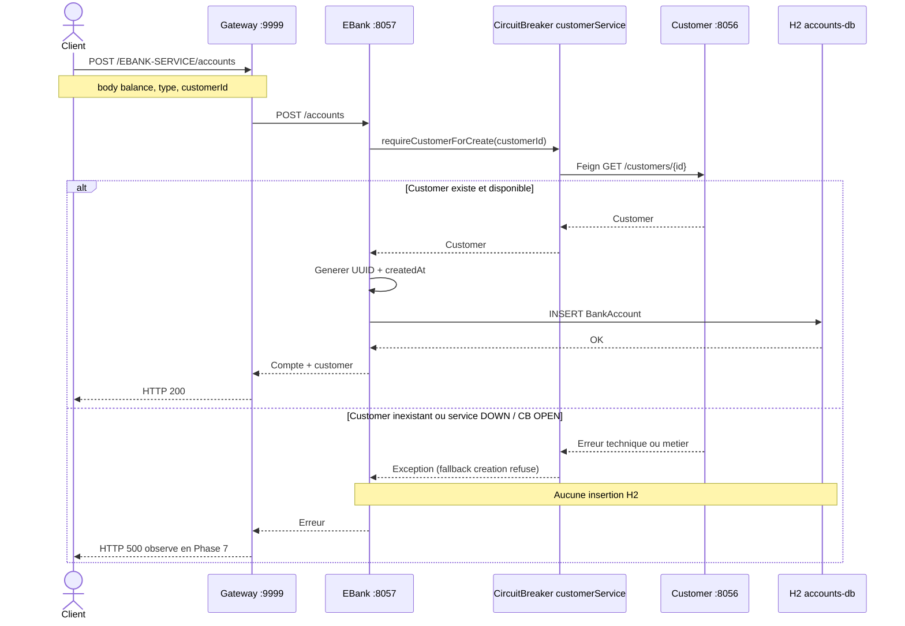

# Diagramme — Création d’un compte (validation obligatoire)

```mermaid
sequenceDiagram
  actor Client
  participant GW as Gateway :9999
  participant EB as EBank :8057
  participant CB as CircuitBreaker customerService
  participant CS as Customer :8056
  participant H2 as H2 accounts-db

  Client->>GW: POST /EBANK-SERVICE/accounts
  Note over Client,GW: body balance, type, customerId
  GW->>EB: POST /accounts
  EB->>CB: requireCustomerForCreate(customerId)
  CB->>CS: Feign GET /customers/{id}

  alt Customer existe et disponible
    CS-->>CB: Customer
    CB-->>EB: Customer
    EB->>EB: Generer UUID + createdAt
    EB->>H2: INSERT BankAccount
    H2-->>EB: OK
    EB-->>GW: Compte + customer
    GW-->>Client: HTTP 200
  else Customer inexistant ou service DOWN / CB OPEN
    CS-->>CB: Erreur technique ou metier
    CB-->>EB: Exception (fallback creation refuse)
    Note over EB,H2: Aucune insertion H2
    EB-->>GW: Erreur
    GW-->>Client: HTTP 500 observe en Phase 7
  end
```

## Règle métier

**Jamais** de fallback de succès sur la création : si la validation distante échoue, le compte n’est pas créé.
