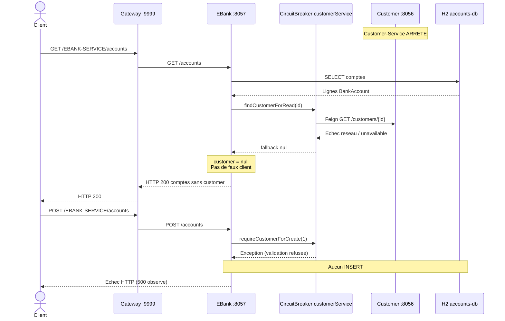

# Diagramme — Panne Customer-Service

```mermaid
sequenceDiagram
  actor Client
  participant GW as Gateway :9999
  participant EB as EBank :8057
  participant CB as CircuitBreaker customerService
  participant CS as Customer :8056
  participant H2 as H2 accounts-db

  Note over CS: Customer-Service ARRETE

  Client->>GW: GET /EBANK-SERVICE/accounts
  GW->>EB: GET /accounts
  EB->>H2: SELECT comptes
  H2-->>EB: Lignes BankAccount
  EB->>CB: findCustomerForRead(id)
  CB->>CS: Feign GET /customers/{id}
  CS-->>CB: Echec reseau / unavailable
  CB-->>EB: fallback null
  Note over EB: customer = null<br/>Pas de faux client
  EB-->>GW: HTTP 200 comptes sans customer
  GW-->>Client: HTTP 200

  Client->>GW: POST /EBANK-SERVICE/accounts
  GW->>EB: POST /accounts
  EB->>CB: requireCustomerForCreate(1)
  CB-->>EB: Exception (validation refusee)
  Note over EB,H2: Aucun INSERT
  EB-->>Client: Echec HTTP (500 observe)
```

## Résultats Phase 7

- GET dégradé : HTTP 200, `customer=null`, soldes conservés.
- POST pendant panne : HTTP 500, nombre de comptes inchangé.
